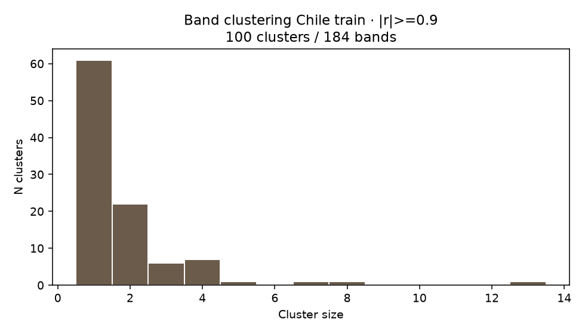
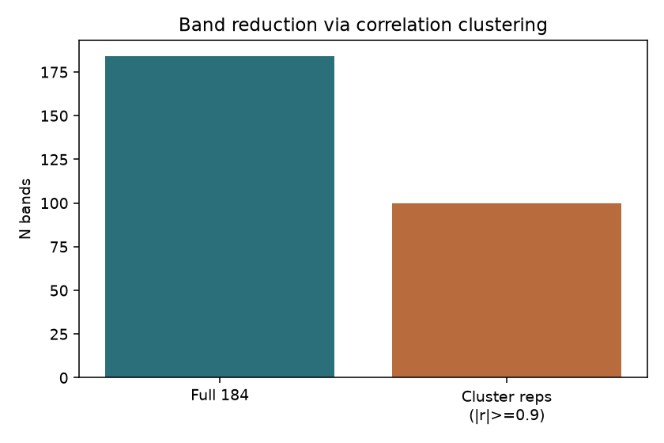
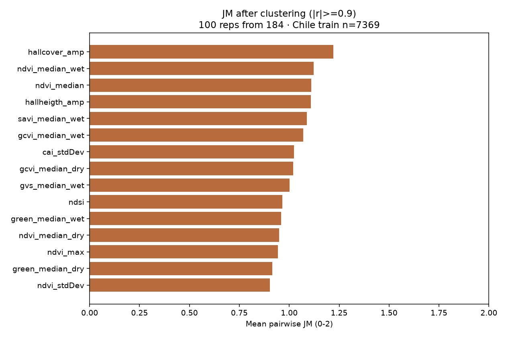

# CLUSTER_JM_all_chile_184bands_REPORT

**Clustering de correlación (|r|≥0.9) + JM sobre representantes — Chile completo (todas las ecorregiones juntas)**

| Campo | Valor |
| --- | --- |
| Rama / scripts | `feat/fs_me` · `scripts/08_cluster_and_jm_chile.py` |
| Entrada | Matriz Chile train `184_bands_all/samples/chile_train_184.npz` |
| Muestras | Col2 `train`, **todas las ecorregiones juntas** |
| Clustering | distancia `1-|r|`, umbral `0.1` ≡ **\|r\| ≥ 0.9** (90%), linkage average |
| Representante | banda más central del cluster (mayor mean \|r\| a miembros) |
| Reducción | **184 → 100** bandas (100 clusters) |
| JM | sobre los representantes del clustering (**sin entrenar**) |
| Resultados crudos | `/home/lserey/mapbiomas_land/tmp/JM_test_ME/all_chile_184bands/` |

---

## 1. Pipeline

```
184 bandas (Chile train)
        │
        ▼
 Clustering |r|≥0.9  →  100 representantes
        │
        ▼
   JM ranking (sobre reps)
```

---

## 2. Clustering





### Resumen clustering

| Métrica | Valor |
| --- | ---: |
| n samples | 7369 |
| n bands in | 184 |
| n clusters / reps | 100 / 100 |
| singletons | 61 |
| max cluster size | 13 |
| corr threshold | 0.9 |

### Datos
- Lista ordenada banda→cluster: [`data/clustering/band_cluster_assignment.csv`](data/clustering/band_cluster_assignment.csv)
- Representantes: [`data/clustering/representatives.csv`](data/clustering/representatives.csv)
- Clusters JSON: [`data/clustering/clusters.json`](data/clustering/clusters.json)
- Band-list para JM: [`data/clustering/band_list_clustering.json`](data/clustering/band_list_clustering.json)

### Top clusters más grandes (por tamaño)

| cluster_id | size | rep |
| --- | --- | --- |
| 40 | 13 | True |
| 36 | 8 | True |
| 73 | 7 | True |
| 27 | 5 | True |
| 26 | 4 | True |
| 35 | 4 | True |
| 19 | 4 | True |
| 74 | 4 | True |
| 42 | 4 | True |
| 47 | 4 | True |
| 18 | 4 | True |
| 16 | 3 | True |
| 58 | 3 | True |
| 65 | 3 | True |
| 84 | 3 | True |

### Primeros representantes (muestra)

| band_index | band_name | cluster_id | cluster_size |
| --- | --- | --- | --- |
| 0 | aspect | 1 | 1 |
| 8 | cai_max | 52 | 2 |
| 9 | cai_median | 68 | 1 |
| 10 | cai_median_dry | 53 | 1 |
| 11 | cai_median_wet | 69 | 1 |
| 12 | cai_min | 14 | 1 |
| 14 | cai_stdDev | 91 | 1 |
| 22 | elevation | 45 | 1 |
| 25 | evi2_median_dry | 84 | 3 |
| 27 | evi2_min | 83 | 2 |
| 28 | evi2_amp | 47 | 4 |
| 30 | fns_max | 21 | 2 |
| 32 | fns_median_dry | 23 | 2 |
| 34 | fns_min | 17 | 2 |
| 35 | fns_amp | 18 | 4 |
| 39 | gcvi_median_dry | 85 | 2 |
| 40 | gcvi_median_wet | 88 | 1 |
| 41 | gcvi_min | 90 | 1 |
| 42 | gcvi_amp | 16 | 3 |
| 46 | green_median_dry | 42 | 4 |

---

## 3. JM después del clustering



### Top 20

| rank | band_index | band_name | mean_jm | min_jm | n_classes_used |
| --- | --- | --- | --- | --- | --- |
| 1 | 71 | hallcover_amp | 1.221282 | 0.000000 | 19 |
| 2 | 94 | ndvi_median_wet | 1.121317 | 0.000303 | 19 |
| 3 | 92 | ndvi_median | 1.109903 | 0.001702 | 19 |
| 4 | 78 | hallheigth_amp | 1.107944 | 0.000000 | 19 |
| 5 | 136 | savi_median_wet | 1.088706 | 0.002197 | 19 |
| 6 | 40 | gcvi_median_wet | 1.069437 | 0.031315 | 19 |
| 7 | 14 | cai_stdDev | 1.024139 | 0.003740 | 19 |
| 8 | 39 | gcvi_median_dry | 1.018643 | 0.000141 | 19 |
| 9 | 62 | gvs_median_wet | 1.002365 | 0.004000 | 19 |
| 10 | 90 | ndsi | 0.965680 | 0.001565 | 19 |
| 11 | 47 | green_median_wet | 0.958950 | 0.003891 | 19 |
| 12 | 93 | ndvi_median_dry | 0.949924 | 0.003333 | 19 |
| 13 | 91 | ndvi_max | 0.942643 | 0.000917 | 19 |
| 14 | 46 | green_median_dry | 0.916026 | 0.004199 | 19 |
| 15 | 97 | ndvi_stdDev | 0.903341 | 0.000955 | 19 |
| 16 | 25 | evi2_median_dry | 0.901209 | 0.003213 | 19 |
| 17 | 89 | ndmi | 0.896124 | 0.001287 | 19 |
| 18 | 125 | pri_stdDev | 0.895793 | 0.000454 | 19 |
| 19 | 101 | ndwi_median_wet | 0.891541 | 0.001415 | 19 |
| 20 | 11 | cai_median_wet | 0.868264 | 0.002512 | 19 |

Ranking completo: [`data/jm_from_clustering/jm_ranking.csv`](data/jm_from_clustering/jm_ranking.csv)

---

## 4. Cómo reproducir

```bash
cd bands_reduction
python scripts/08_cluster_and_jm_chile.py --corr-threshold 0.9 \
  --out-dir /home/lserey/mapbiomas_land/tmp/JM_test_ME/all_chile_184bands
```

(No requiere cluster HPC para n≈7k × 184.)

---

## 5. Archivos

```
CLUSTER_JM_all_chile_184bands_REPORT/
├── README.md
├── figures/
│   ├── cluster_size_hist.png
│   ├── band_reduction_bar.png
│   └── jm_top15_after_clustering.png
└── data/
    ├── clustering/   # assignment, reps, summary, band-list
    └── jm_from_clustering/  # ranking + summary
```
