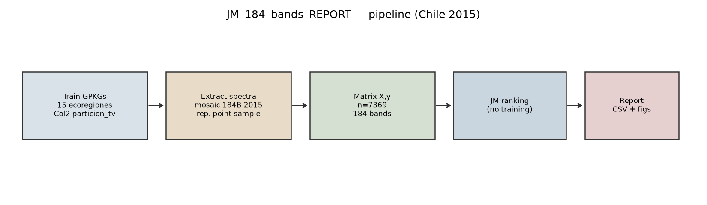
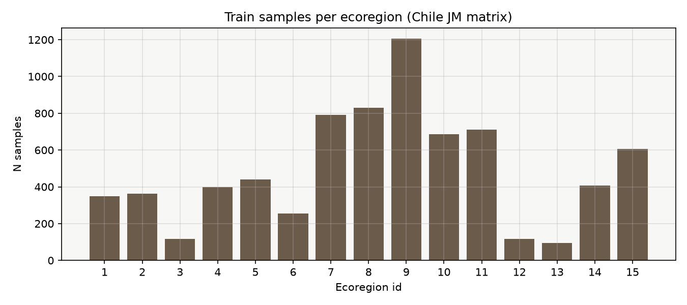
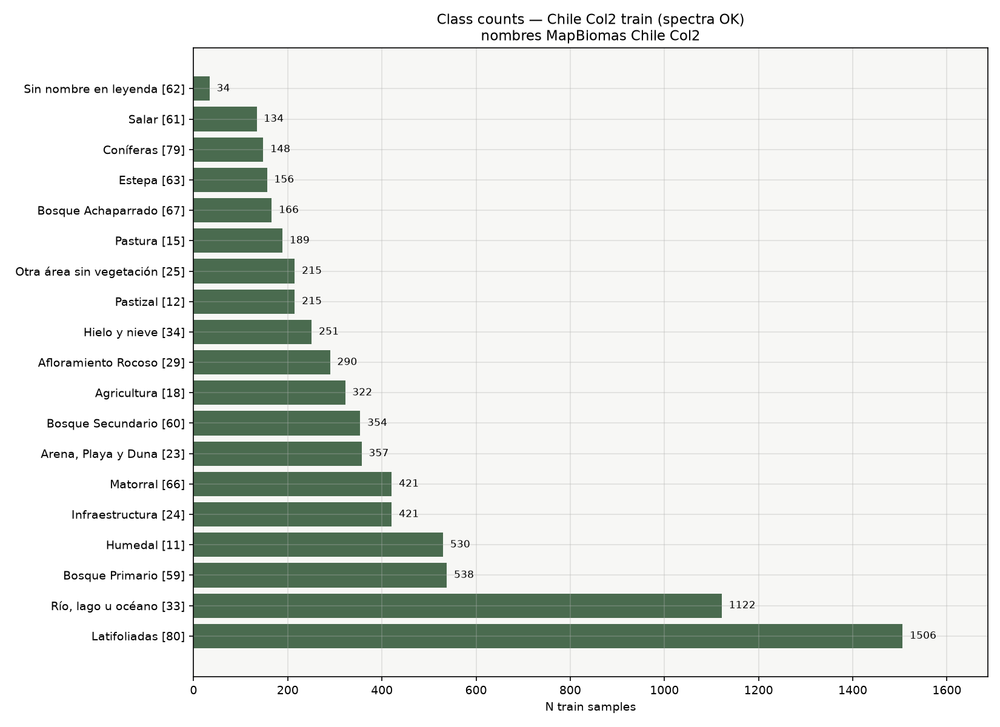
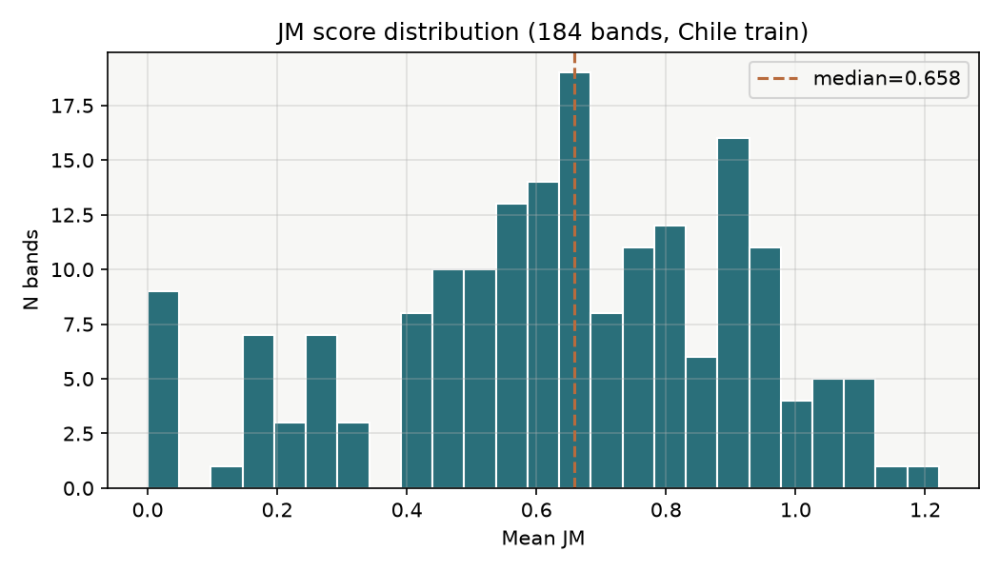
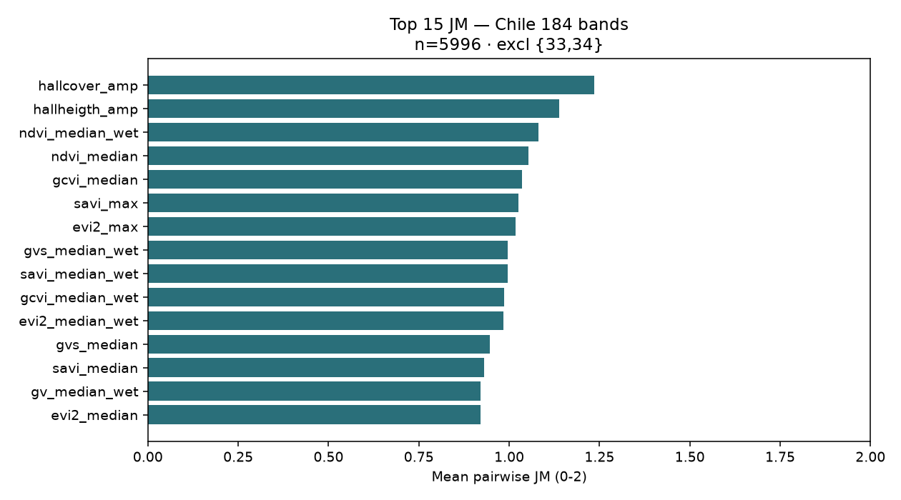
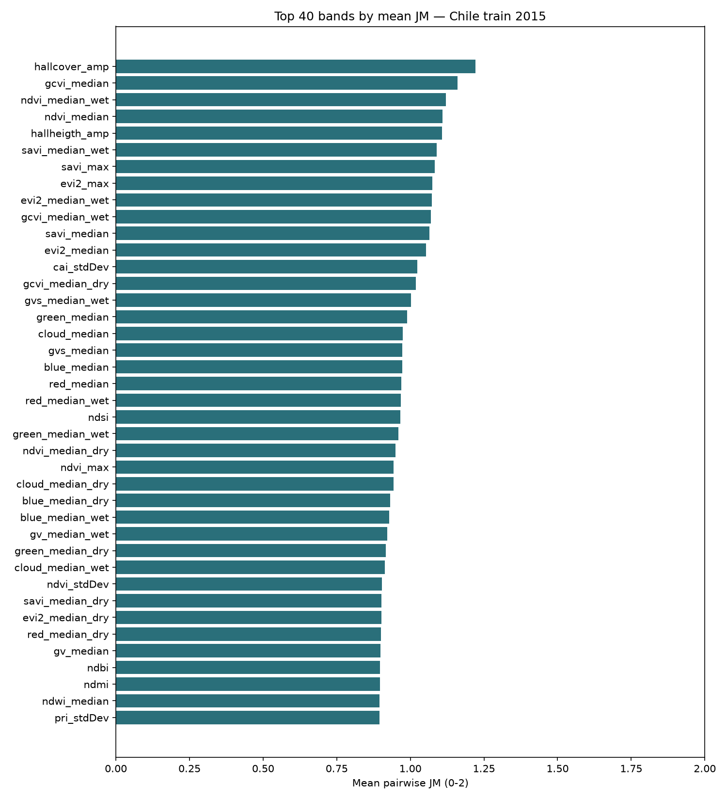

# JM_184_bands_REPORT

**Jeffries-Matusita band ranking — Chile, Landsat mosaic 2015, 184 bands**

| Field | Value |
| --- | --- |
| Scope | All Chile (15 ecoregions combined) |
| Year / mosaic | 2015 · 184-band MapBiomas tiles |
| Method | Univariate Jeffries-Matusita (mean pairwise JM); **no model training** |
| Band set | Full 184 (`source=full`), **no clustering** |
| Samples | Col2 `train` layers only |
| Samples path | `/home/lserey/mapbiomas_land/Muestras_Col2/particion_tv_col2/` |
| n input / n OK | 7377 / 7369 |
| n classes | 19 |
| Extraction | Polygon representative point → `rasterio.sample` |
| Extract time | 1495.3 s (4 tile workers, local node) |
| Git scripts | `scripts/05_build_train_matrix_chile.py`, `06_run_jm_chile_184.py`, `04_run_jm.py` |
| Raw outputs (cluster FS) | `/home/lserey/mapbiomas_land/tmp/JM_test_ME/184_bands_all/` |

---

## 1. Pipeline



1. Load **train** layer from each `E*.gpkg` (15 ecoregions).
2. Assign each sample to an MGRS mosaic tile; extract 184-band spectrum.
3. Build matrix `X (n×184)`, labels `y` (LULC class).
4. Rank every band by **mean pairwise JM** across class pairs.
5. Export CSV/JSON + figures (this report).

JM does **not** train a classifier. The name `train` only means the sample split (vs `val`).

---

## 2. Sample coverage

### Per ecoregion



| eco_id | eco_name | n_samples |
| --- | --- | --- |
| 1 | E1_Puna_seca_andina | 349 |
| 2 | E2_Desierto_Atacama | 362 |
| 3 | E3_Matorral_norte_1 | 117 |
| 4 | E4_Estepa_andina | 398 |
| 5 | E5_Matorral_norte_2 | 439 |
| 6 | E6_Andes_norte | 256 |
| 7 | E7_Andes_central | 790 |
| 8 | E8_Matorral_sur | 830 |
| 9 | E9_Costa_Norte | 1205 |
| 10 | E10_Andes_Sur | 685 |
| 11 | E11_Costa_Sur_1 | 712 |
| 12 | E12_Costa_Sur_2 | 118 |
| 13 | E13_Andes_Sur_Costa | 95 |
| 14 | E14_Estepa_patagonica | 406 |
| 15 | E15_Bosque_subpolar | 607 |

### Per LULC class



Nombres según leyenda MapBiomas Chile Col2 (con id entre corchetes).  
**79** = Coníferas · **80** = Latifoliadas.  
**62** no está en la leyenda Col2 enviada (34 muestras, solo ecorregión E2 Desierto de Atacama); se etiqueta como *Sin nombre en leyenda*.

See [`data/class_counts.csv`](data/class_counts.csv).

---

## 3. JM score distribution



Scores are mean JM over class pairs (theoretical range 0–2). Higher = better average class separability for that single band.

---

## 4. Top bands

### Top 15



### Top 40



### Top 20 (table)

| rank | band_index | band_name | mean_jm | min_jm | n_classes_used |
| --- | --- | --- | --- | --- | --- |
| 1 | 71 | hallcover_amp | 1.221282 | 0.000000 | 19 |
| 2 | 38 | gcvi_median | 1.160880 | 0.001979 | 19 |
| 3 | 94 | ndvi_median_wet | 1.121317 | 0.000303 | 19 |
| 4 | 92 | ndvi_median | 1.109903 | 0.001702 | 19 |
| 5 | 78 | hallheigth_amp | 1.107944 | 0.000000 | 19 |
| 6 | 136 | savi_median_wet | 1.088706 | 0.002197 | 19 |
| 7 | 133 | savi_max | 1.082357 | 0.004266 | 19 |
| 8 | 23 | evi2_max | 1.074528 | 0.002611 | 19 |
| 9 | 26 | evi2_median_wet | 1.073614 | 0.002486 | 19 |
| 10 | 40 | gcvi_median_wet | 1.069437 | 0.031315 | 19 |
| 11 | 134 | savi_median | 1.064382 | 0.021851 | 19 |
| 12 | 24 | evi2_median | 1.053612 | 0.021101 | 19 |
| 13 | 14 | cai_stdDev | 1.024139 | 0.003740 | 19 |
| 14 | 39 | gcvi_median_dry | 1.018643 | 0.000141 | 19 |
| 15 | 62 | gvs_median_wet | 1.002365 | 0.004000 | 19 |
| 16 | 45 | green_median | 0.988449 | 0.000102 | 19 |
| 17 | 16 | cloud_median | 0.974535 | 0.002686 | 19 |
| 18 | 60 | gvs_median | 0.972907 | 0.002585 | 19 |
| 19 | 2 | blue_median | 0.972077 | 0.002301 | 19 |
| 20 | 127 | red_median | 0.968487 | 0.011015 | 19 |

Full ranking CSV: [`data/jm_ranking_full.csv`](data/jm_ranking_full.csv)

---

## 5. Interpretation notes

- This is a **national pooled** JM (all ecoregions together), not one ranking per ecoregion.
- Some bands show `min_jm ≈ 0`: at least one class pair is not separable with that band alone; mean JM can still be high.
- Next (roadmap): JM **per ecoregion**, compare with clustering subsets + Boruta; consolidate intersection/union across ecoregions.

---

## 6. Reproducibility

```bash
cd bands_reduction
python scripts/05_build_train_matrix_chile.py --max-workers 4 \
  --out-dir /home/lserey/mapbiomas_land/tmp/JM_test_ME/184_bands_all
python scripts/06_run_jm_chile_184.py \
  --base-dir /home/lserey/mapbiomas_land/tmp/JM_test_ME/184_bands_all
```

---

## Appendix A — Full ranking of all 184 bands

| rank | band_index | band_name | mean_jm | min_jm | n_pairs | n_classes_used |
| ---: | ---: | --- | ---: | ---: | ---: | ---: |
| 1 | 71 | `hallcover_amp` | 1.221282 | 0.000000 | 171 | 19 |
| 2 | 38 | `gcvi_median` | 1.160880 | 0.001979 | 171 | 19 |
| 3 | 94 | `ndvi_median_wet` | 1.121317 | 0.000303 | 171 | 19 |
| 4 | 92 | `ndvi_median` | 1.109903 | 0.001702 | 171 | 19 |
| 5 | 78 | `hallheigth_amp` | 1.107944 | 0.000000 | 171 | 19 |
| 6 | 136 | `savi_median_wet` | 1.088706 | 0.002197 | 171 | 19 |
| 7 | 133 | `savi_max` | 1.082357 | 0.004266 | 171 | 19 |
| 8 | 23 | `evi2_max` | 1.074528 | 0.002611 | 171 | 19 |
| 9 | 26 | `evi2_median_wet` | 1.073614 | 0.002486 | 171 | 19 |
| 10 | 40 | `gcvi_median_wet` | 1.069437 | 0.031315 | 171 | 19 |
| 11 | 134 | `savi_median` | 1.064382 | 0.021851 | 171 | 19 |
| 12 | 24 | `evi2_median` | 1.053612 | 0.021101 | 171 | 19 |
| 13 | 14 | `cai_stdDev` | 1.024139 | 0.003740 | 171 | 19 |
| 14 | 39 | `gcvi_median_dry` | 1.018643 | 0.000141 | 171 | 19 |
| 15 | 62 | `gvs_median_wet` | 1.002365 | 0.004000 | 171 | 19 |
| 16 | 45 | `green_median` | 0.988449 | 0.000102 | 171 | 19 |
| 17 | 16 | `cloud_median` | 0.974535 | 0.002686 | 171 | 19 |
| 18 | 60 | `gvs_median` | 0.972907 | 0.002585 | 171 | 19 |
| 19 | 2 | `blue_median` | 0.972077 | 0.002301 | 171 | 19 |
| 20 | 127 | `red_median` | 0.968487 | 0.011015 | 171 | 19 |
| 21 | 129 | `red_median_wet` | 0.967554 | 0.013615 | 171 | 19 |
| 22 | 90 | `ndsi` | 0.965680 | 0.001565 | 171 | 19 |
| 23 | 47 | `green_median_wet` | 0.958950 | 0.003891 | 171 | 19 |
| 24 | 93 | `ndvi_median_dry` | 0.949924 | 0.003333 | 171 | 19 |
| 25 | 91 | `ndvi_max` | 0.942643 | 0.000917 | 171 | 19 |
| 26 | 17 | `cloud_median_dry` | 0.942516 | 0.002016 | 171 | 19 |
| 27 | 3 | `blue_median_dry` | 0.931558 | 0.000385 | 171 | 19 |
| 28 | 4 | `blue_median_wet` | 0.927873 | 0.005699 | 171 | 19 |
| 29 | 55 | `gv_median_wet` | 0.922202 | 0.005600 | 171 | 19 |
| 30 | 46 | `green_median_dry` | 0.916026 | 0.004199 | 171 | 19 |
| 31 | 18 | `cloud_median_wet` | 0.912846 | 0.001210 | 171 | 19 |
| 32 | 97 | `ndvi_stdDev` | 0.903341 | 0.000955 | 171 | 19 |
| 33 | 135 | `savi_median_dry` | 0.902513 | 0.003115 | 171 | 19 |
| 34 | 25 | `evi2_median_dry` | 0.901209 | 0.003213 | 171 | 19 |
| 35 | 128 | `red_median_dry` | 0.899939 | 0.009635 | 171 | 19 |
| 36 | 53 | `gv_median` | 0.898672 | 0.006853 | 171 | 19 |
| 37 | 81 | `ndbi` | 0.896147 | 0.001287 | 171 | 19 |
| 38 | 89 | `ndmi` | 0.896124 | 0.001287 | 171 | 19 |
| 39 | 99 | `ndwi_median` | 0.895848 | 0.001287 | 171 | 19 |
| 40 | 125 | `pri_stdDev` | 0.895793 | 0.000454 | 171 | 19 |
| 41 | 101 | `ndwi_median_wet` | 0.891541 | 0.001415 | 171 | 19 |
| 42 | 52 | `gv_max` | 0.886737 | 0.006306 | 171 | 19 |
| 43 | 85 | `ndfi_median_wet` | 0.885873 | 0.000712 | 171 | 19 |
| 44 | 11 | `cai_median_wet` | 0.868264 | 0.002512 | 171 | 19 |
| 45 | 9 | `cai_median` | 0.850859 | 0.002127 | 171 | 19 |
| 46 | 37 | `gcvi_max` | 0.850502 | 0.011990 | 171 | 19 |
| 47 | 180 | `wefi_median_wet` | 0.844146 | 0.005214 | 171 | 19 |
| 48 | 83 | `ndfi_median` | 0.841944 | 0.004383 | 171 | 19 |
| 49 | 130 | `red_min` | 0.831297 | 0.004572 | 171 | 19 |
| 50 | 178 | `wefi_median` | 0.826763 | 0.005168 | 171 | 19 |
| 51 | 63 | `gvs_min` | 0.821228 | 0.000420 | 171 | 19 |
| 52 | 140 | `sefi_max` | 0.816158 | 0.003798 | 171 | 19 |
| 53 | 56 | `gv_min` | 0.813277 | 0.000438 | 171 | 19 |
| 54 | 19 | `cloud_min` | 0.812362 | 0.000626 | 171 | 19 |
| 55 | 67 | `hallcover_median` | 0.807866 | 0.011842 | 171 | 19 |
| 56 | 163 | `swir1_median` | 0.804971 | 0.005283 | 171 | 19 |
| 57 | 143 | `sefi_median_wet` | 0.801767 | 0.001000 | 171 | 19 |
| 58 | 54 | `gv_median_dry` | 0.795418 | 0.002228 | 171 | 19 |
| 59 | 61 | `gvs_median_dry` | 0.794501 | 0.002517 | 171 | 19 |
| 60 | 59 | `gvs_max` | 0.787278 | 0.002104 | 171 | 19 |
| 61 | 48 | `green_min` | 0.783567 | 0.004177 | 171 | 19 |
| 62 | 170 | `swir2_median` | 0.777656 | 0.013438 | 171 | 19 |
| 63 | 120 | `pri_median` | 0.762351 | 0.000425 | 171 | 19 |
| 64 | 5 | `blue_min` | 0.760641 | 0.009642 | 171 | 19 |
| 65 | 80 | `mbi` | 0.756174 | 0.004611 | 171 | 19 |
| 66 | 141 | `sefi_median` | 0.755002 | 0.000623 | 171 | 19 |
| 67 | 42 | `gcvi_amp` | 0.753353 | 0.020222 | 171 | 19 |
| 68 | 172 | `swir2_median_wet` | 0.752674 | 0.004998 | 171 | 19 |
| 69 | 106 | `nir_median` | 0.749753 | 0.007260 | 171 | 19 |
| 70 | 43 | `gcvi_stdDev` | 0.745118 | 0.002792 | 171 | 19 |
| 71 | 108 | `nir_median_wet` | 0.743085 | 0.006039 | 171 | 19 |
| 72 | 165 | `swir1_median_wet` | 0.735645 | 0.013287 | 171 | 19 |
| 73 | 116 | `npv_min` | 0.725496 | 0.000077 | 171 | 19 |
| 74 | 142 | `sefi_median_dry` | 0.721779 | 0.003247 | 171 | 19 |
| 75 | 95 | `ndvi_min` | 0.715857 | 0.003959 | 171 | 19 |
| 76 | 82 | `ndfi_max` | 0.714422 | 0.001118 | 171 | 19 |
| 77 | 41 | `gcvi_min` | 0.701003 | 0.003428 | 171 | 19 |
| 78 | 177 | `wefi_max` | 0.699274 | 0.001930 | 171 | 19 |
| 79 | 157 | `soil_median_dry` | 0.687301 | 0.000150 | 171 | 19 |
| 80 | 171 | `swir2_median_dry` | 0.685170 | 0.017694 | 171 | 19 |
| 81 | 32 | `fns_median_dry` | 0.681428 | 0.000765 | 171 | 19 |
| 82 | 84 | `ndfi_median_dry` | 0.681313 | 0.000673 | 171 | 19 |
| 83 | 58 | `gv_stdDev` | 0.674462 | 0.001512 | 171 | 19 |
| 84 | 86 | `ndfi_min` | 0.673598 | 0.000058 | 171 | 19 |
| 85 | 164 | `swir1_median_dry` | 0.672485 | 0.002639 | 171 | 19 |
| 86 | 181 | `wefi_min` | 0.671652 | 0.000168 | 171 | 19 |
| 87 | 114 | `npv_median_dry` | 0.671241 | 0.001286 | 171 | 19 |
| 88 | 102 | `ndwi_min` | 0.668285 | 0.000037 | 171 | 19 |
| 89 | 156 | `soil_median` | 0.667057 | 0.004073 | 171 | 19 |
| 90 | 159 | `soil_min` | 0.665019 | 0.003481 | 171 | 19 |
| 91 | 30 | `fns_max` | 0.662934 | 0.002476 | 171 | 19 |
| 92 | 31 | `fns_median` | 0.662298 | 0.001062 | 171 | 19 |
| 93 | 104 | `ndwi_stdDev` | 0.654670 | 0.001831 | 171 | 19 |
| 94 | 115 | `npv_median_wet` | 0.649848 | 0.000025 | 171 | 19 |
| 95 | 33 | `fns_median_wet` | 0.645266 | 0.005145 | 171 | 19 |
| 96 | 158 | `soil_median_wet` | 0.643941 | 0.002491 | 171 | 19 |
| 97 | 27 | `evi2_min` | 0.641527 | 0.005867 | 171 | 19 |
| 98 | 107 | `nir_median_dry` | 0.640472 | 0.000313 | 171 | 19 |
| 99 | 10 | `cai_median_dry` | 0.639772 | 0.002493 | 171 | 19 |
| 100 | 121 | `pri_median_dry` | 0.632643 | 0.014966 | 171 | 19 |
| 101 | 137 | `savi_min` | 0.632365 | 0.007256 | 171 | 19 |
| 102 | 12 | `cai_min` | 0.628855 | 0.014195 | 171 | 19 |
| 103 | 179 | `wefi_median_dry` | 0.624949 | 0.000725 | 171 | 19 |
| 104 | 126 | `red_max` | 0.622836 | 0.002589 | 171 | 19 |
| 105 | 57 | `gv_amp` | 0.621615 | 0.001782 | 171 | 19 |
| 106 | 100 | `ndwi_median_dry` | 0.618652 | 0.000960 | 171 | 19 |
| 107 | 15 | `cloud_max` | 0.610912 | 0.000437 | 171 | 19 |
| 108 | 29 | `evi2_stdDev` | 0.606873 | 0.000733 | 171 | 19 |
| 109 | 122 | `pri_median_wet` | 0.604358 | 0.006364 | 171 | 19 |
| 110 | 44 | `green_max` | 0.601682 | 0.002462 | 171 | 19 |
| 111 | 13 | `cai_amp` | 0.599139 | 0.000584 | 171 | 19 |
| 112 | 113 | `npv_median` | 0.598935 | 0.000777 | 171 | 19 |
| 113 | 144 | `sefi_min` | 0.593520 | 0.002287 | 171 | 19 |
| 114 | 98 | `ndwi_max` | 0.585196 | 0.003563 | 171 | 19 |
| 115 | 1 | `blue_max` | 0.584692 | 0.002326 | 171 | 19 |
| 116 | 96 | `ndvi_amp` | 0.581606 | 0.000732 | 171 | 19 |
| 117 | 150 | `shade_median_wet` | 0.578925 | 0.001607 | 171 | 19 |
| 118 | 8 | `cai_max` | 0.575622 | 0.002394 | 171 | 19 |
| 119 | 105 | `nir_max` | 0.573563 | 0.003915 | 171 | 19 |
| 120 | 173 | `swir2_min` | 0.568975 | 0.009488 | 171 | 19 |
| 121 | 148 | `shade_median` | 0.561438 | 0.001722 | 171 | 19 |
| 122 | 21 | `cloud_stdDev` | 0.559944 | 0.000965 | 171 | 19 |
| 123 | 162 | `swir1_max` | 0.551180 | 0.002186 | 171 | 19 |
| 124 | 112 | `npv_max` | 0.550982 | 0.002573 | 171 | 19 |
| 125 | 139 | `savi_stdDev` | 0.547498 | 0.002453 | 171 | 19 |
| 126 | 119 | `pri_max` | 0.539813 | 0.003169 | 171 | 19 |
| 127 | 154 | `slope` | 0.532192 | 0.001240 | 171 | 19 |
| 128 | 7 | `blue_stdDev` | 0.521475 | 0.001475 | 171 | 19 |
| 129 | 28 | `evi2_amp` | 0.520374 | 0.002992 | 171 | 19 |
| 130 | 151 | `shade_min` | 0.518741 | 0.001410 | 171 | 19 |
| 131 | 50 | `green_stdDev` | 0.512994 | 0.000782 | 171 | 19 |
| 132 | 51 | `green_median_texture` | 0.510269 | 0.001223 | 171 | 19 |
| 133 | 22 | `elevation` | 0.507021 | 0.001023 | 171 | 19 |
| 134 | 118 | `npv_stdDev` | 0.503202 | 0.001668 | 171 | 19 |
| 135 | 132 | `red_stdDev` | 0.498165 | 0.001128 | 171 | 19 |
| 136 | 166 | `swir1_min` | 0.494860 | 0.000932 | 171 | 19 |
| 137 | 183 | `wefi_stdDev` | 0.483142 | 0.002149 | 171 | 19 |
| 138 | 169 | `swir2_max` | 0.474519 | 0.008834 | 171 | 19 |
| 139 | 20 | `cloud_amp` | 0.473341 | 0.000124 | 171 | 19 |
| 140 | 103 | `ndwi_amp` | 0.473295 | 0.001476 | 171 | 19 |
| 141 | 124 | `pri_amp` | 0.468212 | 0.000696 | 171 | 19 |
| 142 | 149 | `shade_median_dry` | 0.457020 | 0.002677 | 171 | 19 |
| 143 | 109 | `nir_min` | 0.456109 | 0.001003 | 171 | 19 |
| 144 | 138 | `savi_amp` | 0.455927 | 0.000562 | 171 | 19 |
| 145 | 155 | `soil_max` | 0.447999 | 0.008117 | 171 | 19 |
| 146 | 34 | `fns_min` | 0.445198 | 0.004404 | 171 | 19 |
| 147 | 6 | `blue_amp` | 0.432197 | 0.002441 | 171 | 19 |
| 148 | 182 | `wefi_amp` | 0.426799 | 0.000340 | 171 | 19 |
| 149 | 49 | `green_amp` | 0.419053 | 0.000160 | 171 | 19 |
| 150 | 111 | `nir_stdDev` | 0.416553 | 0.005826 | 171 | 19 |
| 151 | 117 | `npv_amp` | 0.413678 | 0.003609 | 171 | 19 |
| 152 | 123 | `pri_min` | 0.405714 | 0.007254 | 171 | 19 |
| 153 | 131 | `red_amp` | 0.402568 | 0.000006 | 171 | 19 |
| 154 | 79 | `hallheigth_stdDev` | 0.392063 | 0.002223 | 171 | 19 |
| 155 | 147 | `shade_max` | 0.332536 | 0.000549 | 171 | 19 |
| 156 | 110 | `nir_amp` | 0.326889 | 0.003896 | 171 | 19 |
| 157 | 146 | `sefi_stdDev` | 0.305972 | 0.000080 | 171 | 19 |
| 158 | 176 | `tpi` | 0.292586 | 0.000248 | 171 | 19 |
| 159 | 153 | `shade_stdDev` | 0.277376 | 0.001546 | 171 | 19 |
| 160 | 145 | `sefi_amp` | 0.266620 | 0.001310 | 171 | 19 |
| 161 | 160 | `soil_amp` | 0.254926 | 0.000741 | 171 | 19 |
| 162 | 35 | `fns_amp` | 0.254154 | 0.000268 | 171 | 19 |
| 163 | 65 | `gvs_stdDev` | 0.249127 | 0.000541 | 171 | 19 |
| 164 | 36 | `fns_stdDev` | 0.246082 | 0.002122 | 171 | 19 |
| 165 | 161 | `soil_stdDev` | 0.229945 | 0.000636 | 171 | 19 |
| 166 | 88 | `ndfi_stdDev` | 0.222017 | 0.000089 | 171 | 19 |
| 167 | 168 | `swir1_stdDev` | 0.196558 | 0.002592 | 171 | 19 |
| 168 | 167 | `swir1_amp` | 0.191541 | 0.001132 | 171 | 19 |
| 169 | 174 | `swir2_amp` | 0.190278 | 0.000041 | 171 | 19 |
| 170 | 72 | `hallcover_stdDev` | 0.189706 | 0.000178 | 171 | 19 |
| 171 | 175 | `swir2_stdDev` | 0.186256 | 0.000572 | 171 | 19 |
| 172 | 152 | `shade_amp` | 0.180385 | 0.000424 | 171 | 19 |
| 173 | 64 | `gvs_amp` | 0.175766 | 0.001073 | 171 | 19 |
| 174 | 87 | `ndfi_amp` | 0.148916 | 0.001071 | 171 | 19 |
| 175 | 0 | `aspect` | 0.122114 | 0.000167 | 171 | 19 |
| 176 | 66 | `hallcover_max` | 0.000000 | 0.000000 | 171 | 19 |
| 177 | 68 | `hallcover_median_dry` | 0.000000 | 0.000000 | 171 | 19 |
| 178 | 69 | `hallcover_median_wet` | 0.000000 | 0.000000 | 171 | 19 |
| 179 | 70 | `hallcover_min` | 0.000000 | 0.000000 | 171 | 19 |
| 180 | 73 | `hallheigth_max` | 0.000000 | 0.000000 | 171 | 19 |
| 181 | 74 | `hallheigth_median` | 0.000000 | 0.000000 | 171 | 19 |
| 182 | 75 | `hallheigth_median_dry` | 0.000000 | 0.000000 | 171 | 19 |
| 183 | 76 | `hallheigth_median_wet` | 0.000000 | 0.000000 | 171 | 19 |
| 184 | 77 | `hallheigth_min` | 0.000000 | 0.000000 | 171 | 19 |

---

## Appendix B — Files in this report folder

```
JM_184_bands_REPORT/
├── README.md
├── figures/
│   ├── pipeline_jm_chile_184.png
│   ├── eco_counts_chile_train.png
│   ├── class_counts_chile_train.png
│   ├── jm_hist_chile_184.png
│   ├── jm_top15_chile_184.png
│   └── jm_top40_chile_184.png
└── data/
    ├── jm_ranking_full.csv
    ├── jm_ranking_top40.csv
    ├── jm_ranking.csv
    ├── jm_summary.json
    ├── band_list_full_184.json
    ├── band_list_jm.json
    ├── 05_extract_summary.json
    ├── eco_sample_counts.csv
    └── class_counts.csv
```
